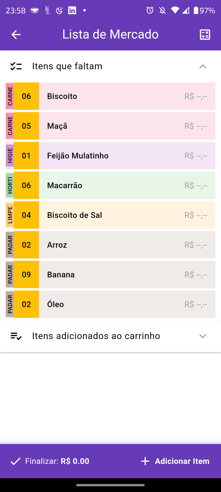
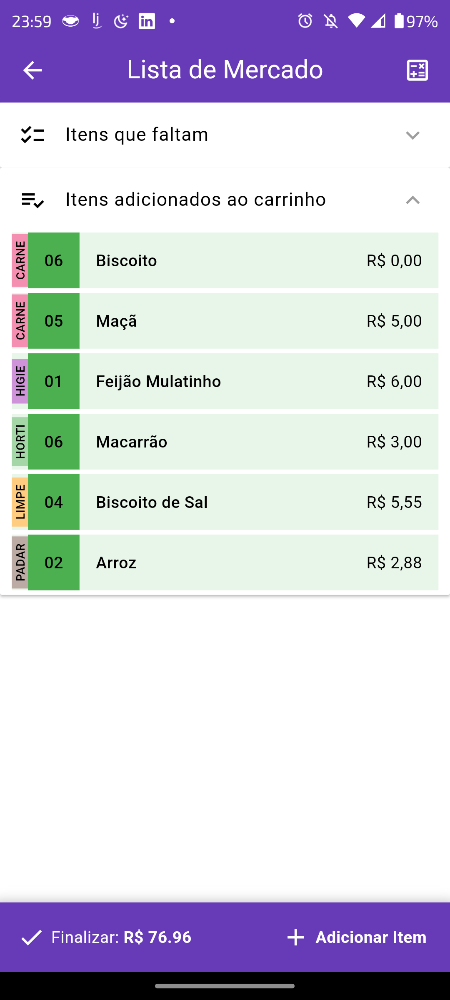

# Sobre o Lista de Mercado

O Lista de Mercado é um aplicativo desenvolvido para simplificar e facilitar suas compras no mercado. Com uma interface intuitiva ele oferece uma maneira conveniente de criar e gerenciar listas de compras, economizando tempo e estresse durante suas idas ao mercado.

## Recursos Principais

- **Crie Listas Personalizadas:** Crie listas de compras personalizadas de acordo com suas necessidades e preferências.
- **Gerencie suas Listas:** Adicione, remova e edite itens facilmente em suas listas de compras.
- **Experiência Intuitiva:** Interface de usuário simples e intuitiva, projetada para facilitar a navegação e o uso do aplicativo.
- **Economize Tempo:** Otimize suas compras e economize tempo durante suas visitas ao mercado.

## Capturas de Tela

## Como Contribuir

Se você deseja contribuir para o desenvolvimento do Lista de Mercado, fique à vontade para abrir problemas (issues) ou enviar solicitações de pull (pull requests) no repositório do GitHub.

## Licença

Este projeto está disponibilizado sob a licença [Copyright ROBERTO DE JESUS](LICENSE).

